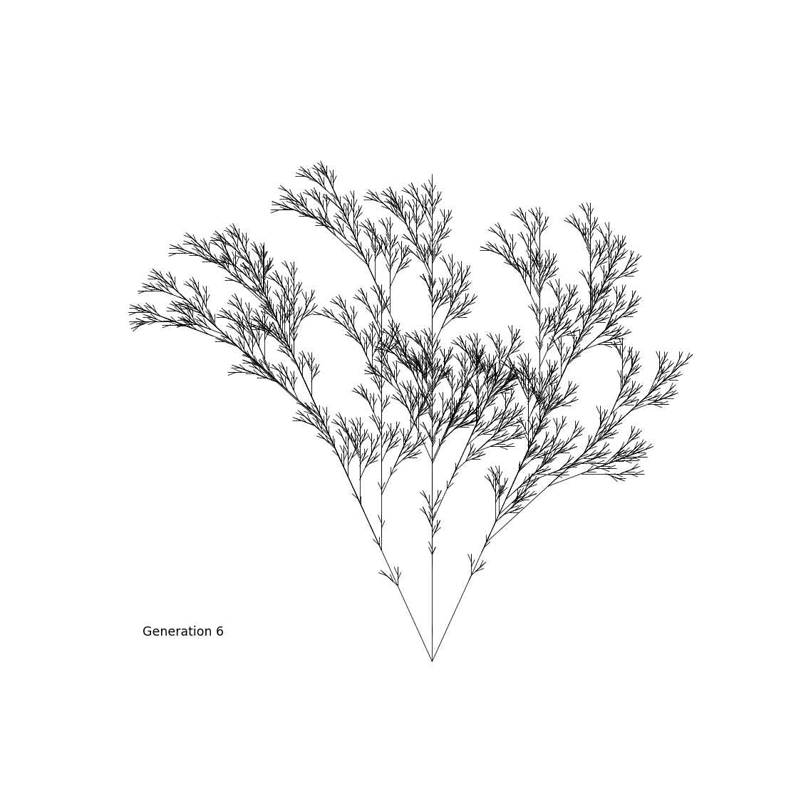

# Lindenmayer-System-Web-App
## Generates .gif files of fractals which imitate plant life, through use of string replacement systems and regex.
###Setup
Run `pipenv install` to install the env.
`python app.py` to host the app for yourself
Visit  on a web browser to get started!
###Dev Setup
Run `pipenv install --dev` to install the env.
Use functions from RulesAndInstructions to build new blueprints for fractals.
See main() within renderer.py for an example
###Happy fractal-ing!

